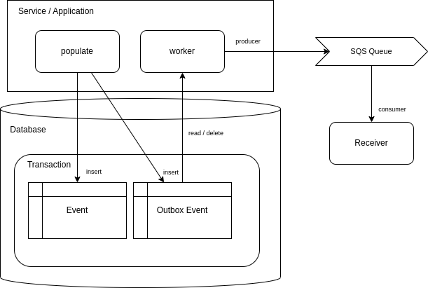

# outbox
Sample Python implementation of Outbox Event Pattern



## Pre-Reqs

- Ubuntu Operating System
- GNU Make
- Poetry (https://github.com/python-poetry/install.python-poetry.org)
- AWS cli


## Set-up

Configure aws cli for fake environment (Localstack)

```
aws configure
AWS Access Key ID [None]: fakeAccessKeyId
AWS Secret Access Key [None]: fakeSecretAccessKey
Default region name [None]: us-east-1
Default output format [None]: json
```


Install libraries

```
# Take a look at Makefile before running
cd outbox
make install
poetry init
```

Start Database and LocalStack (AWS Mockup Services)

```
make infra-start
```

Create database and queue

```
make infra-create
```

Start applications

```
make worker
make receiver
```

Publish messages

```
make populate
```

# Check data

Login to adminer:

```
database type: PostgreSQL
http://localhost:8080
user: `postgres`
database: `postgres`
password: `example`
```
